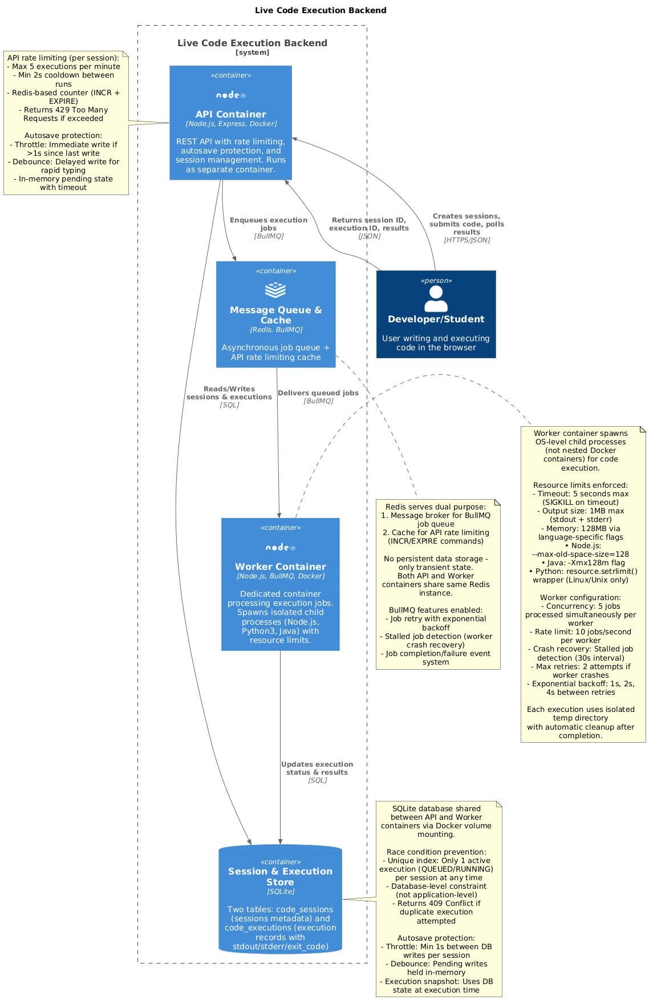

# Live Code Execution Backend

A scalable backend service for executing code in multiple programming languages with session management, queue-based processing, and anti-spam protection.

## Prerequisites

Before running this project locally, ensure you have the following installed:

- **Node.js** (v20 or higher)
- **npm** (comes with Node.js)
- **Redis** (v7 or higher)
- **Docker** and **Docker Compose** (optional, for containerized setup)

## Setup Instructions (How to Run Locally)

### Option 1: Local Development (Without Docker)

#### 1. Clone the Repository

```bash
git clone https://github.com/BuhDuy256/live-code-execution-backend.git
cd live-code-execution-backend
```

#### 2. Install Dependencies

```bash
npm install
```

#### 3. Set Up Environment Variables

Create a `.env` file for local development:

```bash
cp .env.local.example .env
```

The default configuration should work for local development:

```env
NODE_ENV=development
PORT=3000
REDIS_HOST=localhost  # Redis on localhost
REDIS_PORT=6379
DB_PATH=./data/database.db
```

#### 4. Start Redis Server

You have several options to run Redis:

**Option A: Redis on Docker (Recommended for Windows/macOS)**

```bash
docker run -d --name redis-local -p 6379:6379 redis:7-alpine
```

Verify Redis is running:

```bash
docker exec redis-local redis-cli ping
# Should return: PONG
```

To stop Redis:

```bash
docker stop redis-local
docker rm redis-local
```

**Option B: Native Redis Installation**

_macOS (using Homebrew):_

```bash
brew services start redis
```

_Linux:_

```bash
sudo systemctl start redis
```

_Windows:_

```bash
# Use WSL2 with Redis installed, or use Docker (Option A above)
```

Verify Redis is running (for native installation):

```bash
redis-cli ping
# Should return: PONG
```

#### 5. Initialize the Database

Run the database initialization script:

```bash
npm run db:init
```

To reset the database (drops all existing data):

```bash
npm run db:reset
```

#### 6. Start the Development Server

```bash
npm run dev
```

The API server will start on `http://localhost:3000`

#### 7. Start the Worker Process (In a Separate Terminal)

**For Development (with auto-reload):**

```bash
npx ts-node-dev src/workers/index.ts
```

**For Production (after build):**

```bash
npm run build
node dist/workers/index.js
```

### Option 2: Docker Compose (Recommended for Production-like Environment)

#### 1. Clone the Repository

```bash
git clone https://github.com/BuhDuy256/live-code-execution-backend.git
cd live-code-execution-backend
```

#### 2. Set Up Environment Variables

Create a `.env` file for Docker:

```bash
cp .env.docker.example .env
```

The default configuration uses Docker service names:

```env
NODE_ENV=production
PORT=3000
REDIS_HOST=redis  # Docker service name
REDIS_PORT=6379
DB_PATH=./data/database.db
```

> **Note:** When switching between local and Docker, use the appropriate `.env` file:
>
> - Local: `cp .env.local.example .env`
> - Docker: `cp .env.docker.example .env`

#### 3. Build and Start All Services

```bash
docker-compose up --build
```

To run in detached mode:

```bash
docker-compose up -d --build
```

This will start:

- **API Server** on `http://localhost:3000`
- **Worker Process** for executing code
- **Redis** for queue management

#### 4. Initialize the Database (If Needed)

The database will be automatically created. If you need to reset it:

```bash
docker-compose exec api npm run db:reset
```

#### 5. View Logs

```bash
# All services
docker-compose logs -f

# Specific service
docker-compose logs -f api
docker-compose logs -f worker
docker-compose logs -f redis
```

#### 6. Stop Services

```bash
docker-compose down
```

To remove volumes (including database and Redis data):

```bash
docker-compose down -v
```

### Available Scripts

- `npm run dev` - Start development server with auto-reload
- `npm run build` - Build TypeScript to JavaScript
- `npm start` - Start production server
- `npm run db:init` - Initialize database
- `npm run db:reset` - Reset database (drops all data)
- `npm run test:race` - Run race condition tests (local)
- `npm run test:spam` - Run spam protection tests (local)
- `npm run test:limits` - Run resource limits tests (local)
- `npm run test:all` - Run all integration tests (local)
- `npm run test:race:docker` - Run race condition tests (Docker)
- `npm run test:spam:docker` - Run spam protection tests (Docker)
- `npm run test:limits:docker` - Run resource limits tests (Docker)
- `npm run test:all:docker` - Run all integration tests (Docker)
- `npm run lint` - Run ESLint
- `npm run lint:fix` - Fix ESLint issues

## Architecture diagram



## API Documentation

### Code Sessions

#### Create Session

Create a new coding session.

**Endpoint:** `POST /code-sessions`

**Request Body:**

```json
{
  "language": "javascript"
}
```

**Response:** `200 OK`

```json
{
  "session_id": "550e8400-e29b-41d4-a716-446655440000",
  "status": "ACTIVE"
}
```

---

#### Update Session

Update the source code in a session (autosave).

**Endpoint:** `PATCH /code-sessions/:session_id`

**Request Body:**

```json
{
  "language": "javascript",
  "source_code": "console.log('Hello World');"
}
```

**Response:** `200 OK`

```json
{
  "session_id": "550e8400-e29b-41d4-a716-446655440000",
  "status": "ACTIVE"
}
```

---

#### Run Code

Execute code in a session asynchronously.

**Endpoint:** `POST /code-sessions/:session_id/run`

**Response:** `200 OK`

```json
{
  "execution_id": "660e8400-e29b-41d4-a716-446655440001",
  "status": "QUEUED"
}
```

---

#### Close Session

Close a coding session (marks it as INACTIVE).

**Endpoint:** `DELETE /code-sessions/:session_id`

**Response:** `200 OK`

```json
{
  "session_id": "550e8400-e29b-41d4-a716-446655440000",
  "status": "INACTIVE"
}
```

---

### Executions

#### Get Execution Status

Check the status and result of a code execution.

**Endpoint:** `GET /executions/:execution_id`

**Response:** `200 OK`

**While Running:**

```json
{
  "execution_id": "660e8400-e29b-41d4-a716-446655440001",
  "status": "RUNNING"
}
```

**When Completed:**

```json
{
  "execution_id": "660e8400-e29b-41d4-a716-446655440001",
  "status": "COMPLETED",
  "stdout": "Hello World\n",
  "stderr": "",
  "execution_time_ms": 45,
  "created_at": "2026-01-21T10:30:00.000Z",
  "completed_at": "2026-01-21T10:30:00.045Z"
}
```

---

### Supported Languages

Currently supported:

- `javascript`
- `python`
- `java`

You can add more languages by editing the `LANGUAGE_CONFIG` in [src/config/constants.ts](src/config/constants.ts).

---

### Status Values

**Session Status:**

- `ACTIVE` - Session is available for use
- `INACTIVE` - Session is closed

**Execution Status:**

- `QUEUED` - Waiting to be executed
- `RUNNING` - Currently executing
- `COMPLETED` - Successfully completed
- `FAILED` - Execution failed
- `TIMEOUT` - Execution exceeded time limit

---

### Error Responses

**400 Bad Request:**

```json
{
  "error": "Validation error",
  "details": ["Language is required"]
}
```

**404 Not Found:**

```json
{
  "error": "Session not found"
}
```

**429 Too Many Requests:**

```json
{
  "error": "Too many requests. Please wait before submitting another execution."
}
```

**500 Internal Server Error:**

```json
{
  "error": "Internal server error"
}
```

## Design Decisions and Trade-offs

### Async Execution with Queue

**Problem:** Running user code takes time. If the API waits for code to finish, it becomes slow and blocks other requests.

**Decision:** Use Redis + BullMQ for background processing. The API adds jobs to the queue and returns immediately. A separate Worker process picks up jobs and runs the code.

**Trade-off:** This adds complexity. The system now has three parts: API, Redis, and Worker. Clients must poll for results because the API does not wait.

---

### Code Isolation

**Problem:** User code is untrusted. It can contain infinite loops, produce large output, or crash the server.

**Decision:** Run code in a child process with a 5-second timeout and 1MB output limit. If the process exceeds these limits, it is killed immediately.

**Trade-off:** Child process is less secure than Docker containers. It relies on OS-level limits, not full sandboxing.

---

### Database Choice

**Problem:** Need to store session and execution state quickly.

**Decision:** Use SQLite for simplicity. It requires zero setup and works well for a take-home assignment.

**Trade-off:** SQLite does not support concurrent writes. It is not suitable for multiple API instances in production.

---

### Autosave Spam Protection

**Problem:** Users typing rapidly can generate hundreds of autosave requests per minute. Without throttling, each keystroke would trigger a database write, overwhelming SQLite and degrading performance.

**Decision:** Use adaptive throttling with three strategies:

- **Write throttling** — Maximum 1 database write per second per session
- **Request coalescing** — Only the latest code is saved; previous pending autosaves are cancelled
- **Forced write on timeout** — If autosaves have been pending for >5 seconds, force a write to prevent data loss

**Trade-off:** Autosave state (pending writes) is stored in memory. If the API crashes, pending autosaves are lost, but the last successfully saved version remains in the database.

---

### Idempotency Handling

**Problem:** Users may click "Run" multiple times quickly, or buggy clients may send duplicate requests. This could create duplicate executions.

**Decision:** Use multiple layers of protection:

1. **Active execution check** — Reject if session already has a `QUEUED` or `RUNNING` execution
2. **Cooldown period** — Short cooldown after each execution
3. **Rate limit** — Maximum 5 executions per minute per session
4. **Database constraint** — SQLite rejects duplicate execution IDs as a fallback

**Trade-off:** Not true exactly-once execution. If the Worker crashes after running code but before updating the database, BullMQ retries may cause the code to run again.

---

## What I Would Improve with More Time

### 1. Stronger Container Isolation

**Current**: Child processes with timeout limits  
**Improvement**: Use Docker or gVisor for fully sandboxed code execution

The current system runs user code in isolated child processes. While this provides basic isolation, it relies on OS-level timeout and memory limits. Docker or gVisor would provide stronger sandboxing and prevent malicious code from accessing the host system.

---

### 2. Horizontal Scaling with PostgreSQL

**Current**: SQLite (single-writer database)  
**Improvement**: Migrate to PostgreSQL with connection pooling

SQLite is a single-file database that cannot handle concurrent writes from multiple API servers. Migrating to PostgreSQL would enable:

- Multiple API instances writing concurrently
- Read replicas for better read performance
- Connection pooling for efficient resource usage

---

### 3. Observability and Monitoring

**Current**: Console logs only  
**Improvement**: Add structured logging, metrics, and dashboards

I would add:

- **Structured logging** with log levels and request tracing
- **Prometheus metrics** to track queue length, execution time, error rates, and throughput
- **BullMQ Dashboard** (Bull Board) for real-time queue visibility
- **Alerting** for critical issues (queue backlog, worker failures, high error rates)

---

### 4. Real-time Updates with WebSocket/SSE

**Current**: Manual polling from frontend  
**Improvement**: Use WebSocket or Server-Sent Events (SSE) for real-time execution updates

Currently, the frontend must poll the `GET /executions/:execution_id` endpoint repeatedly to check if code execution is complete. This creates unnecessary network traffic and adds latency.

I would implement:

- **WebSocket** or **SSE** connection for pushing execution status updates to the frontend
- Real-time notifications when execution status changes: `QUEUED` → `RUNNING` → `COMPLETED`/`FAILED`/`TIMEOUT`
- Reduced server load by eliminating constant polling requests
- Better user experience with instant feedback

**Trade-off**: Adds complexity for connection management, reconnection logic, and scaling WebSocket connections across multiple API instances.

---

### 5. Advanced Queue Management

**Current**: FIFO queue with automatic cleanup  
**Improvement**: Add queue size limits, priority queues, and per-language queues

I would implement:

- **Max queue size** (e.g., 1000 jobs) to prevent Redis memory exhaustion
- **Priority queue** for retries and premium users
- **Separate queues** per programming language for better isolation
- **Backpressure mechanism** to reject new jobs when the system is overloaded

---

### 6. Worker Scaling and Resource Management

**Current**: Manual worker deployment  
**Improvement**: Auto-scaling with Kubernetes and per-session resource fairness

I would add:

- **Kubernetes-based auto-scaling** to add/remove workers based on queue length
- **Fair resource allocation** to ensure each session gets equal CPU/memory
- **Language-specific timeout limits** (e.g., Python might need more time than JavaScript)
- **Adaptive timeout** based on code complexity analysis

---

### 7. Dead Letter Queue (DLQ) for Failed Jobs

**Current**: Failed jobs are stored in the database with no reprocessing  
**Out of scope**: Automatic DLQ with alerting and reprocessing

I would add:

- Dedicated dead letter queue for jobs that exhaust all retries
- Manual reprocessing interface for debugging failed executions
- Automated alerts when DLQ size exceeds threshold
